# 🏗️ Architecture Overview
## AI-Powered Release Orchestration Platform

---

## 📊 High-Level Architecture

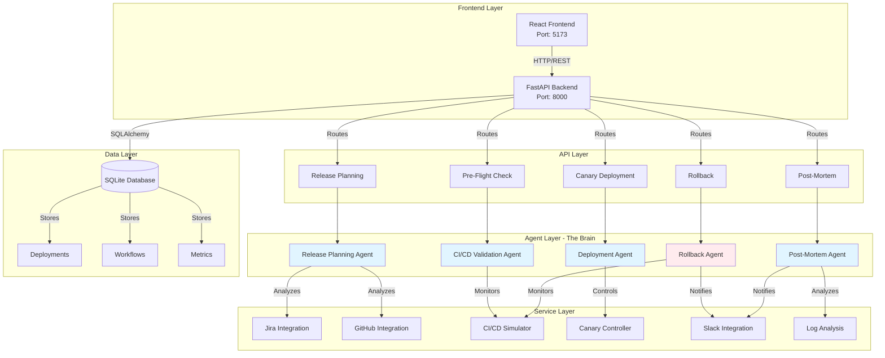

---

## 🤖 Agent Architecture - The Five Pillars

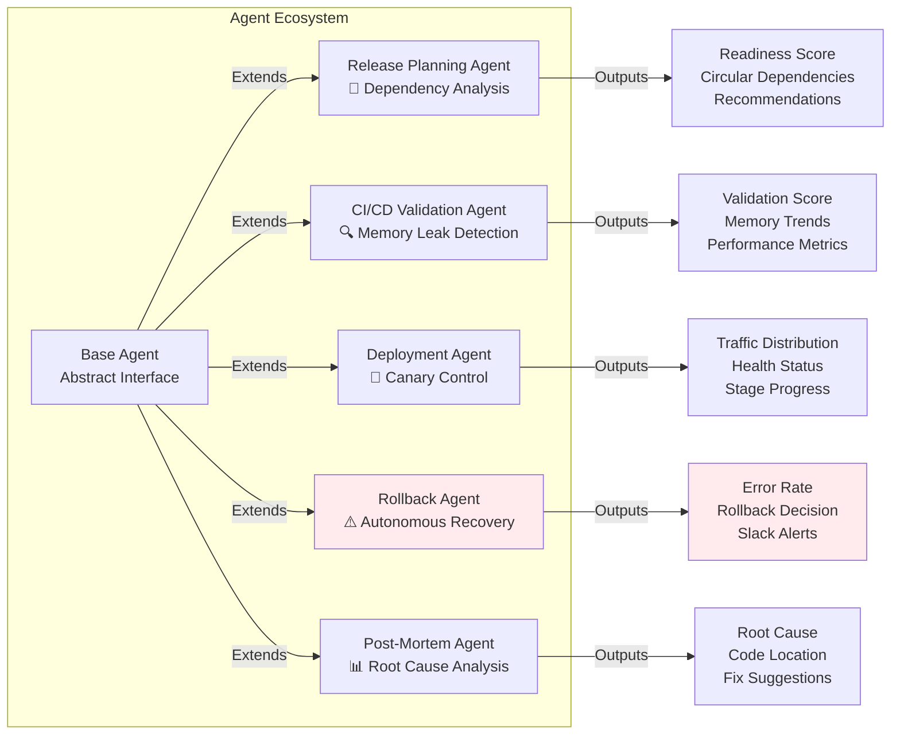

---

## 🔄 Deployment Flow - End to End

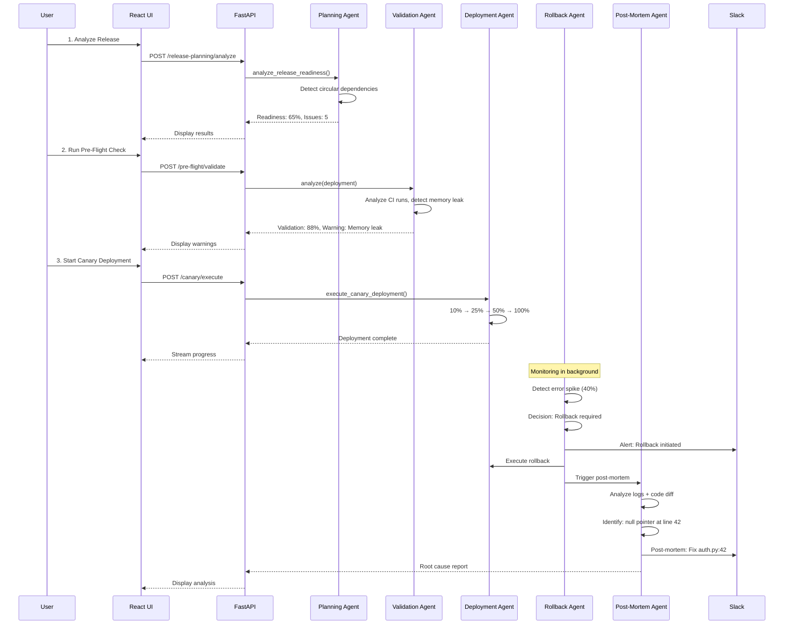

---

## 🎯 Canary Deployment State Machine

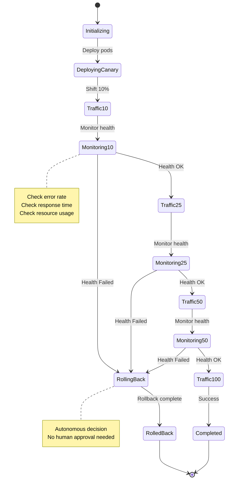

---

## 🔐 Data Models

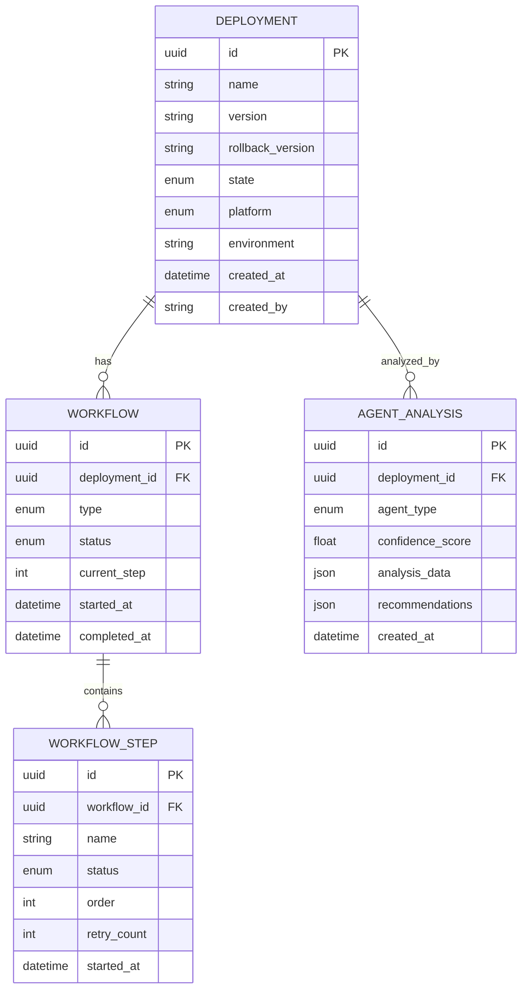

---

## 🌐 API Architecture

```mermaid
graph TB
    subgraph "API Routes"
        V1[/api/v1]
        V1 --> RP[/release-planning]
        V1 --> PF[/pre-flight]
        V1 --> CD[/canary]
        V1 --> RB[/rollback]
        V1 --> PM[/postmortem]
        V1 --> DEMO[/demo]
    end
    
    subgraph "Release Planning Endpoints"
        RP --> RP1[POST /analyze<br/>Analyze readiness]
    end
    
    subgraph "Pre-Flight Endpoints"
        PF --> PF1[POST /deployments/:id/pre-flight-check<br/>Validate deployment]
    end
    
    subgraph "Canary Endpoints"
        CD --> CD1[POST /deployments/:id/execute-canary<br/>Start canary]
        CD --> CD2[GET /deployments/:id/stream<br/>SSE progress stream]
        CD --> CD3[GET /deployments/:id/status<br/>Get status]
    end
    
    subgraph "Rollback Endpoints"
        RB --> RB1[POST /deployments/:id/start-monitoring<br/>Start monitoring]
        RB --> RB2[POST /deployments/:id/inject-error<br/>Inject errors (demo)]
        RB --> RB3[GET /deployments/:id/analysis<br/>Get analysis]
    end
    
    subgraph "Post-Mortem Endpoints"
        PM --> PM1[POST /deployments/:id/analyze<br/>Analyze failure]
        PM --> PM2[GET /deployments/:id/report<br/>Get report]
    end
```

---

## 🔧 Technology Stack

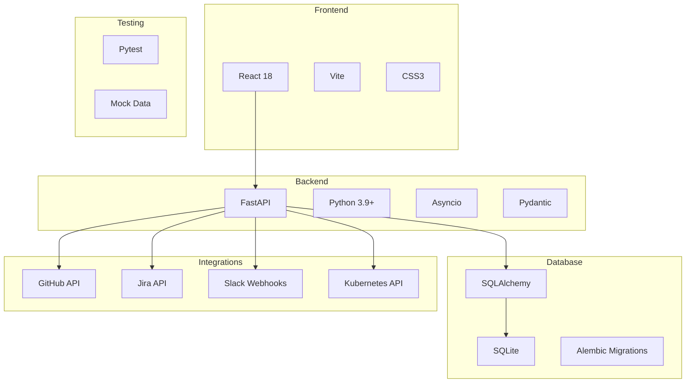

---

## 🚀 Deployment Architecture

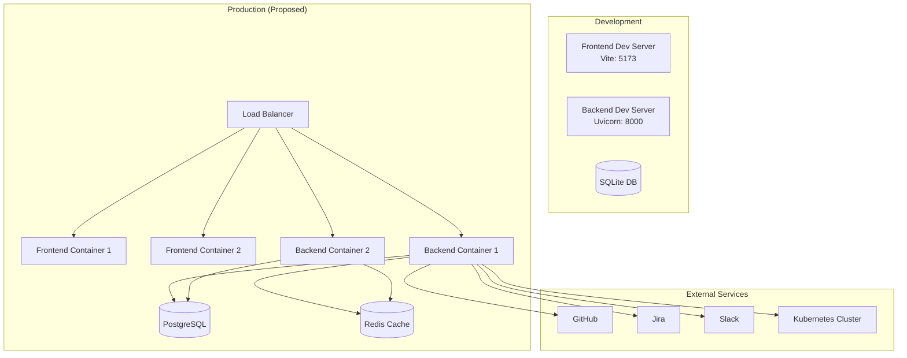

---

## 🔄 Autonomous Rollback Decision Flow

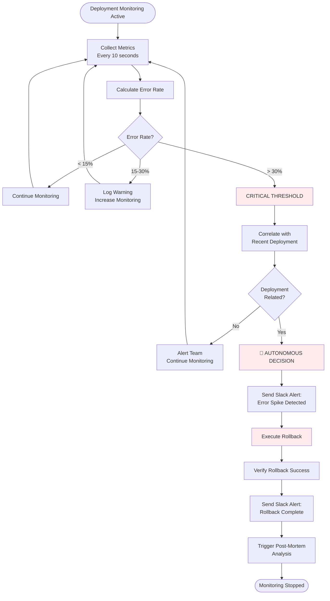

---

## 📈 Monitoring & Observability

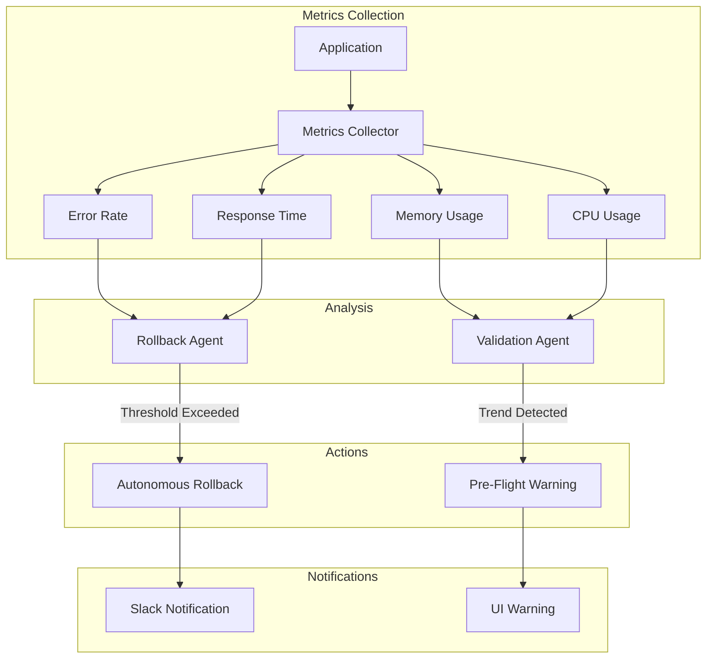

---

## 🎨 Frontend Component Architecture

```mermaid
graph TB
    APP[App.jsx<br/>Main Container]
    
    APP --> NAV[Navigation]
    APP --> DASHBOARD[Dashboard]
    
    DASHBOARD --> RP_COMP[ReleasePlanningForm<br/>Step 1]
    DASHBOARD --> PF_COMP[PreFlightCheck<br/>Step 2]
    DASHBOARD --> CD_COMP[CanaryDashboard<br/>Step 3]
    DASHBOARD --> RB_COMP[RollbackDemo<br/>Step 4]
    DASHBOARD --> PM_COMP[PostMortemView<br/>Step 5]
    
    RP_COMP --> |API Call| RP_API[/api/v1/release-planning]
    PF_COMP --> |API Call| PF_API[/api/v1/pre-flight]
    CD_COMP --> |SSE Stream| CD_API[/api/v1/canary]
    RB_COMP --> |WebSocket| RB_API[/api/v1/rollback]
    PM_COMP --> |API Call| PM_API[/api/v1/postmortem]
```

---

## 🔒 Security Architecture

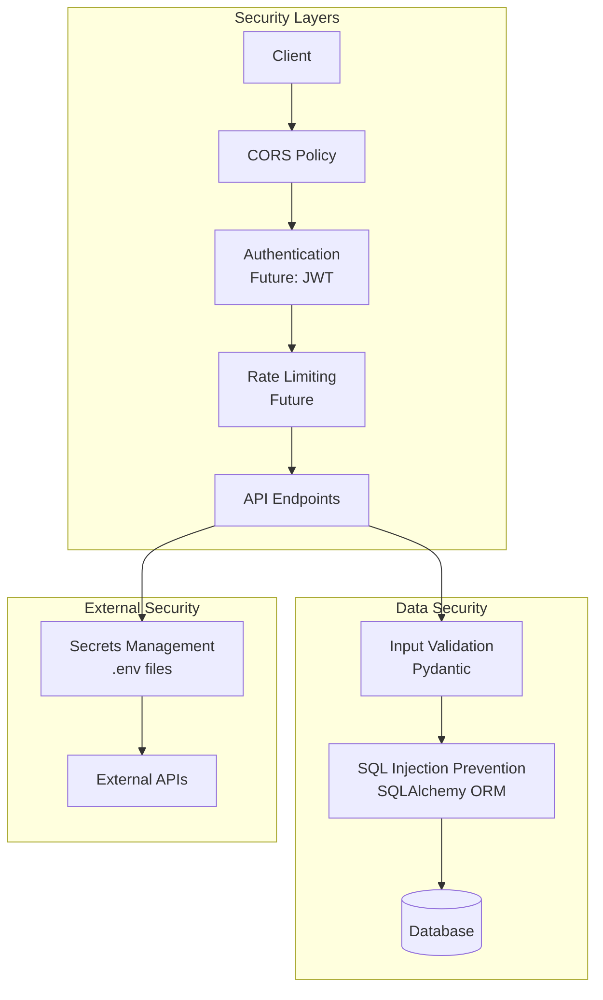

---

## 📊 Performance Characteristics

| Component | Technology | Performance |
|-----------|-----------|-------------|
| **API Response Time** | FastAPI + Async | < 100ms (avg) |
| **Database Queries** | SQLAlchemy + SQLite | < 50ms (avg) |
| **Agent Analysis** | Python Algorithms | 1-3 seconds |
| **Canary Deployment** | Progressive Rollout | 35-45 seconds |
| **Rollback Detection** | Real-time Monitoring | < 10 seconds |
| **Frontend Load** | React + Vite | < 2 seconds |

---

## 🎯 Key Design Principles

1. **Autonomous Decision-Making**
   - Agents make decisions without human approval
   - Threshold-based triggers for critical actions
   - Fail-safe mechanisms for safety

2. **Modularity**
   - Each agent is independent and specialized
   - Loose coupling between components
   - Easy to add new agents or features

3. **Real-Time Monitoring**
   - Continuous metric collection
   - Async processing for performance
   - SSE/WebSocket for live updates

4. **Observability**
   - Comprehensive logging
   - Slack notifications for critical events
   - Detailed analysis reports

5. **Extensibility**
   - Plugin architecture for integrations
   - Configurable thresholds and behaviors
   - LLM-ready for future enhancements

---

## 🚀 Future Enhancements

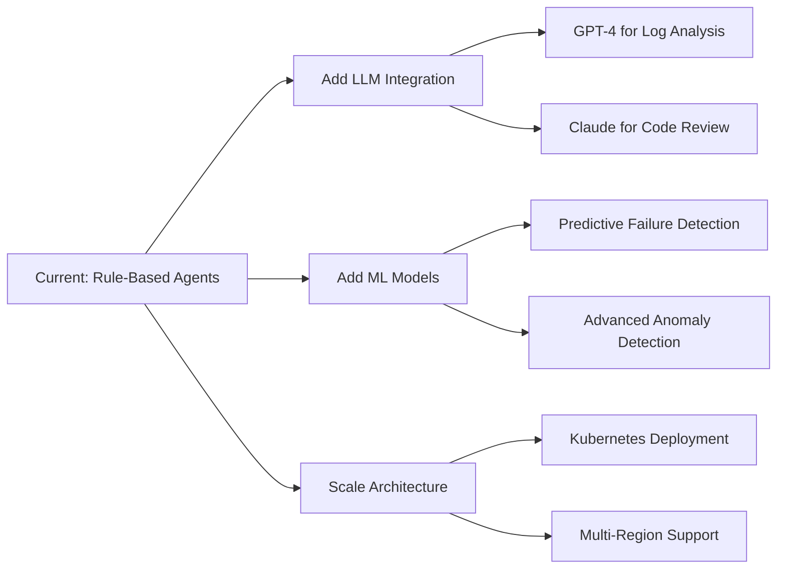

---

**Architecture designed for: Autonomy, Intelligence, and Scale** 🚀