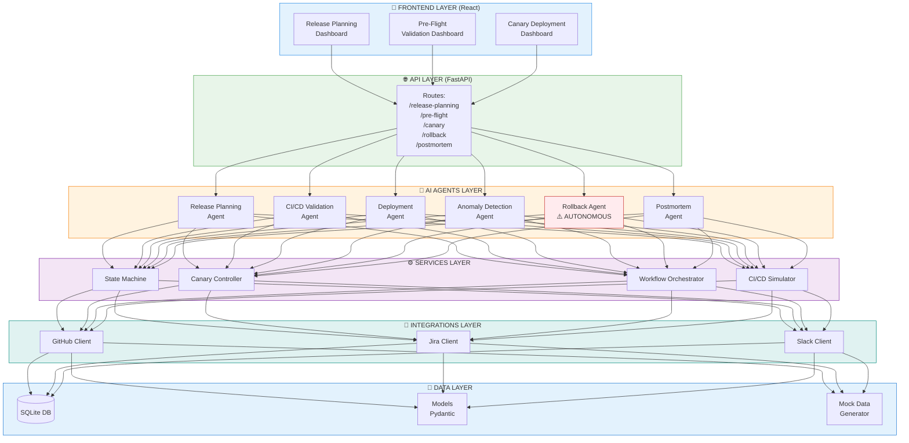

# 🏗️ System Architecture Diagram
## AI-Powered Release Orchestration Platform

---

## 📊 Complete Architecture (All Layers)

```
┌─────────────────────────────────────────────────────────────────┐
│                    FRONTEND LAYER (React)                        │
│  ┌──────────────┐  ┌──────────────┐  ┌──────────────┐          │
│  │  Release     │  │  Pre-Flight  │  │   Canary     │          │
│  │  Planning    │  │  Validation  │  │  Deployment  │          │
│  │  Dashboard   │  │  Dashboard   │  │  Dashboard   │          │
│  └──────────────┘  └──────────────┘  └──────────────┘          │
│         │                  │                  │                  │
└─────────┼──────────────────┼──────────────────┼──────────────────┘
          │                  │                  │
          ▼                  ▼                  ▼
┌─────────────────────────────────────────────────────────────────┐
│                    API LAYER (FastAPI)                           │
│  ┌──────────────────────────────────────────────────────────┐   │
│  │  Routes: /release-planning, /pre-flight, /canary,        │   │
│  │          /rollback, /postmortem                           │   │
│  └──────────────────────────────────────────────────────────┘   │
└─────────────────────────────────────────────────────────────────┘
          │
          ▼
┌─────────────────────────────────────────────────────────────────┐
│                    AI AGENTS LAYER                               │
│  ┌──────────────┐  ┌──────────────┐  ┌──────────────┐          │
│  │  Release     │  │  CI/CD       │  │  Deployment  │          │
│  │  Planning    │  │  Validation  │  │  Agent       │          │
│  │  Agent       │  │  Agent       │  │              │          │
│  └──────────────┘  └──────────────┘  └──────────────┘          │
│  ┌──────────────┐  ┌──────────────┐  ┌──────────────┐          │
│  │  Anomaly     │  │  Rollback    │  │  Postmortem  │          │
│  │  Detection   │  │  Agent       │  │  Agent       │          │
│  │  Agent       │  │  ⚠️ AUTO     │  │              │          │
│  └──────────────┘  └──────────────┘  └──────────────┘          │
└─────────────────────────────────────────────────────────────────┘
          │
          ▼
┌─────────────────────────────────────────────────────────────────┐
│                    SERVICES LAYER                                │
│  ┌──────────────┐  ┌──────────────┐  ┌──────────────┐          │
│  │  State       │  │  Canary      │  │  Workflow    │          │
│  │  Machine     │  │  Controller  │  │  Orchestrator│          │
│  └──────────────┘  └──────────────┘  └──────────────┘          │
│  ┌──────────────┐                                               │
│  │  CI/CD       │                                               │
│  │  Simulator   │                                               │
│  └──────────────┘                                               │
└─────────────────────────────────────────────────────────────────┘
          │
          ▼
┌─────────────────────────────────────────────────────────────────┐
│                    INTEGRATIONS LAYER                            │
│  ┌──────────────┐  ┌──────────────┐  ┌──────────────┐          │
│  │  GitHub      │  │  Jira        │  │  Slack       │          │
│  │  Client      │  │  Client      │  │  Client      │          │
│  └──────────────┘  └──────────────┘  └──────────────┘          │
└─────────────────────────────────────────────────────────────────┘
          │
          ▼
┌─────────────────────────────────────────────────────────────────┐
│                    DATA LAYER                                    │
│  ┌──────────────┐  ┌──────────────┐  ┌──────────────┐          │
│  │  SQLite DB   │  │  Models      │  │  Mock Data   │          │
│  │              │  │  (Pydantic)  │  │  Generator   │          │
│  └──────────────┘  └──────────────┘  └──────────────┘          │
└─────────────────────────────────────────────────────────────────┘
```

---

## 🔄 Mermaid Diagram (GitHub/Markdown Compatible)



---

## 📁 File Structure Mapping

```
semicolons-release-orchestrator/
│
├── frontend/src/                    # 🎨 FRONTEND LAYER
│   ├── App.jsx
│   └── components/
│       ├── ReleasePlanningForm.jsx
│       ├── PreFlightCheck.jsx
│       └── CanaryDashboard.jsx
│
├── backend/
│   ├── main.py                      # 🌐 API ENTRY POINT
│   │
│   ├── routes/                      # 🌐 API LAYER
│   │   ├── release_planning.py
│   │   ├── pre_flight.py
│   │   ├── canary_deployment.py
│   │   ├── rollback.py
│   │   └── postmortem.py
│   │
│   ├── agents/                      # 🤖 AI AGENTS LAYER
│   │   ├── base_agent.py
│   │   ├── release_planning_agent.py
│   │   ├── cicd_validation_agent.py
│   │   ├── deployment_agent.py
│   │   ├── anomaly_agent.py
│   │   ├── rollback_agent.py       # ⚠️ AUTONOMOUS
│   │   └── postmortem_agent.py
│   │
│   ├── services/                    # ⚙️ SERVICES LAYER
│   │   ├── state_machine.py
│   │   ├── canary_controller.py
│   │   ├── cicd_simulator.py
│   │   └── workflows/
│   │       └── orchestrator.py
│   │
│   ├── integrations/                # 🔌 INTEGRATIONS LAYER
│   │   ├── github_client.py
│   │   ├── jira_client.py
│   │   └── slack_client.py
│   │
│   ├── models/                      # 💾 DATA LAYER
│   │   ├── deployment.py
│   │   ├── workflow.py
│   │   ├── agent.py
│   │   └── state.py
│   │
│   ├── mock_data/                   # 💾 DATA LAYER
│   │   └── fixtures.py
│   │
│   └── utils/                       # 💾 DATA LAYER
│       └── database.py
│
└── release_orchestrator.db          # 💾 SQLite Database
```

---

## 🎯 Layer Responsibilities

### 1. Frontend Layer (React)
- **Purpose:** User interface and interaction
- **Technology:** React 18 + Vite
- **Components:** 3 main dashboards
- **Communication:** HTTP REST API calls to backend

### 2. API Layer (FastAPI)
- **Purpose:** REST API endpoints and request handling
- **Technology:** FastAPI + Uvicorn
- **Routes:** 5 main route modules
- **Features:** SSE streaming, async support

### 3. AI Agents Layer
- **Purpose:** Intelligent decision-making and analysis
- **Technology:** Python rule-based algorithms
- **Agents:** 6 specialized agents
- **Key Feature:** Autonomous Rollback Agent

### 4. Services Layer
- **Purpose:** Business logic and orchestration
- **Technology:** Python async services
- **Components:** 4 core services
- **Features:** State management, canary control, workflow orchestration

### 5. Integrations Layer
- **Purpose:** External system connectivity
- **Technology:** API clients (mock/real)
- **Integrations:** GitHub, Jira, Slack
- **Mode:** Supports both mock and real implementations

### 6. Data Layer
- **Purpose:** Data persistence and models
- **Technology:** SQLite + SQLAlchemy + Pydantic
- **Components:** Database, models, mock data
- **Features:** ORM, validation, fixtures

---

## 🔄 Data Flow Example: Release Planning

```
User Input (GitHub repo + Jira sprint)
    ↓
Frontend: ReleasePlanningForm.jsx
    ↓ HTTP POST
API: routes/release_planning.py
    ↓
Agent: release_planning_agent.py
    ├→ Integration: jira_client.py → Fetch tickets
    └→ Integration: github_client.py → Fetch repo data
    ↓
Agent: Analyze dependencies, calculate score
    ↓
Service: Store results in database
    ↓
API: Return JSON response
    ↓
Frontend: Display readiness score & issues
```

---

## ⚠️ Autonomous Rollback Flow

```
Deployment Running
    ↓
Agent: rollback_agent.py (monitoring every 10s)
    ↓
Detect: Error rate > 30%
    ↓
Decision: AUTONOMOUS ROLLBACK (no human approval)
    ↓
Service: cicd_simulator.py → Execute rollback
    ↓
Integration: slack_client.py → Send notification
    ↓
Agent: postmortem_agent.py → Analyze failure
    ↓
Integration: slack_client.py → Send post-mortem
```

---

## 🎨 Color Legend

- 🔵 **Blue** - Frontend & Data layers
- 🟢 **Green** - API layer
- 🟠 **Orange** - AI Agents layer
- 🟣 **Purple** - Services layer
- 🟢 **Teal** - Integrations layer
- 🔴 **Red** - Autonomous/Critical components

---

**This architecture enables: Autonomy, Intelligence, Scalability, and Reliability** 🚀